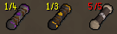

# Scroll Box Counter

A RuneLite plugin that displays the maximum number of clue scroll boxes you can hold for each tier.

- **Visual Counter**: Shows current/maximum clue scroll boxes (e.g., "4/5") next to the existing quantity
- **Full Stack Warning**: Highlights the counter in red when you've reached the maximum capacity

## Configuration

Access the plugin settings through RuneLite's plugin panel:

- **Show Counter**: Toggle the counter display on/off
- **Mark Full Stacks**: Enable red highlighting when at maximum capacity

