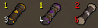
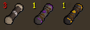
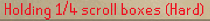

# Scroll Box Counter  

A RuneLite plugin that displays the maximum number of clue scroll boxes you can hold for each tier.

## Features

### Max scroll box 

**Max clue scroll display**: Shows maximum clue scroll boxes at the bottom of clue scroll boxes in your bank and inventory.

**Full stack warning**: Highlights the counter in red when you've reached the maximum capacity.

### Banked count

Displays the number of clue scroll boxes + clues you currently have in your bank (**only after you have visited a bank**).

### Only marking full stacks

Config options allow to only mark full stacks and remove all other overlays.

### Game chat message
When you get a clue scroll box, it will show the number of boxes + clues you are currently holding and the maximum you can hold.

## Configuration

Access the plugin settings through RuneLite's plugin panel:

- **Mark Full Stacks**: Enable red highlighting when at maximum capacity
- **Max Clue Scrolls Position**: Toggle the counter display on/off and choose its position (left or right)
- **Show Banked Count**: Display the number of clue scroll boxes + clues in your bank
- **Show Game Chat Message**: Enable or disable the game chat message when receiving a clue scroll box

