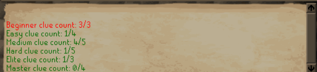

# Scroll Box Info

### **Scroll Box Info** is a plugin that helps track various information about clue-related items. It provides customizable item tooltips, item overlays, infoboxes, chat messages, and menu options

# **Features:**

# **Tooltip Overlay**

### Provides a tooltip overlay for scroll boxes/clue scrolls that tracks the following data:
- Banked: How many clues you have in the bank
- Current total: How many clues you have across your inventory and bank
- Stack limit: How many clues of that tier you can currently hold at one time
- Next unlock: How many more clues must be completed to increase your stack limit

# **Item Overlay**

### Provides an item overlay for scroll boxes/clue scrolls that displays the following:
- Mark full stacks red: Marks the scroll box amount red when you’ve hit your stack limit
- Show tier label: Displays the clue tier name over clue items
- Color tier labels: Colors the tier labels over clue items

- Banked: How many clues you have in the bank
- Current total: How many clues you have across your inventory and bank
- Stack limit: How many clues of that tier you can currently hold at one time

# **Infobox**

### Provides an infobox for scroll boxes that displays the following:
- Full stacks: Displays an infobox when you've reached your clue stack limit
- Tier toggles: Options to show or hide infoboxes for certain tiers

# **Chat Message**

### Sends a chat message of your current total number of scroll boxes/clues you own whenever you receive a scroll box

# **Menu Option**

### Adds a "View clue counts" menu option to your inventory tab

